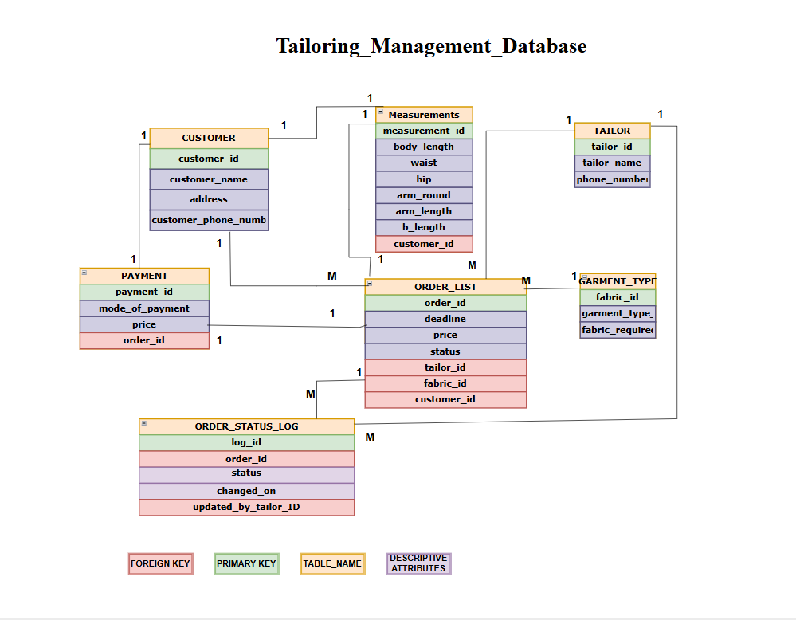

# Tailoring Management Database

A comprehensive MySQL database system designed to streamline tailoring business operations, providing data-driven insights for customer management, order tracking, and business analytics.

## 🎯 Project Overview

**Problem**: Traditional tailoring businesses struggle with manual record-keeping, leading to missed deadlines, payment tracking issues, and lack of business insights.

**Solution**: A normalized relational database that manages customers, orders, measurements, payments, and tailors with built-in analytics capabilities.

**Objectives**:
- Centralized customer and order management
- Real-time order status tracking
- Revenue and performance analytics
- Data integrity through proper normalization

## 📊 Entity Relationship Diagram




## 🗃️ Database Schema

The database consists of 8 interconnected tables:

- **`customer`** - Customer personal information and contact details
- **`measurements`** - Body measurements for custom tailoring
- **`order_list`** - Order details, pricing, and deadlines
- **`garment_type`** - Catalog of garment types and fabric requirements
- **`my_tailor`** - Tailor information and contact details
- **`payment`** - Payment records and transaction methods
- **`order_status_log`** - Audit trail for order status changes
- **`customer_order_details`** - Junction table linking customers, orders, and tailors

## 📈 Key Analytics Queries

```sql
-- Monthly Revenue Analysis
SELECT 
    DATE_FORMAT(STR_TO_DATE(deadline, '%d-%m-%y'), '%Y-%m') as month,
    SUM(CAST(price AS UNSIGNED)) as total_revenue
FROM order_list 
WHERE status = 'COMPLETED'
GROUP BY month;

-- Top Performing Tailors
SELECT 
    t.tailor_name,
    COUNT(ol.oid) as total_orders,
    SUM(CAST(ol.price AS UNSIGNED)) as revenue_generated
FROM my_tailor t
JOIN order_list ol ON t.tailor_id = ol.tailor_id
WHERE ol.status = 'COMPLETED'
GROUP BY t.tailor_id
ORDER BY revenue_generated DESC;

-- Orders Beyond Deadline
SELECT 
    c.cname as customer_name,
    ol.deadline,
    gt.type_name as garment,
    ol.price
FROM order_list ol
JOIN customer c ON ol.fid = c.cid
JOIN garment_type gt ON ol.fid = gt.fid
WHERE ol.status = 'PENDING' 
AND STR_TO_DATE(ol.deadline, '%d-%m-%y') < CURDATE();
```

## 🛠️ Tech Stack

- **Database**: MySQL 8.0
- **Modeling Tool**: Draw.io
- **Query Language**: SQL
- **Design Pattern**: 3NF Normalization

## 🚀 Getting Started

1. **Clone the repository**
   ```bash
   git clone https://github.com/yourusername/tailoring-management-database.git
   cd tailoring-management-database
   ```

2. **Set up MySQL database**
   ```bash
   mysql -u root -p
   CREATE DATABASE tailor;
   USE tailor;
   ```

3. **Import the database**
   ```bash
   mysql -u root -p tailor < schema/tailoring_schema.sql
   mysql -u root -p tailor < schema/sample_data.sql
   ```

4. **Run analytics queries**
   ```bash
   mysql -u root -p tailor < queries.sql
   ```

## 💡 Business Insights

- **Revenue Tracking**: Monitor monthly income and identify peak seasons
- **Performance Management**: Track tailor productivity and customer satisfaction
- **Inventory Planning**: Analyze fabric requirements by garment popularity
- **Customer Analytics**: Identify high-value customers and ordering patterns

## 📋 Features

✅ **Data Integrity**: Foreign key constraints and normalized design  
✅ **Audit Trail**: Complete order status history tracking  
✅ **Flexible Pricing**: Support for multiple payment methods  
✅ **Scalable Design**: Easy to extend for additional business requirements  

---

*This project demonstrates proficiency in database design, SQL querying, and business intelligence concepts.*
